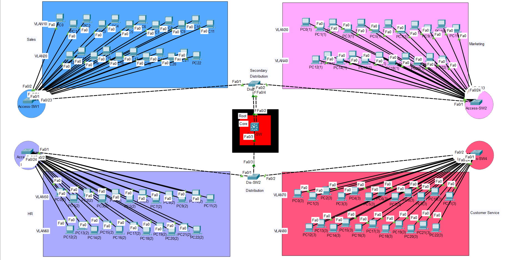
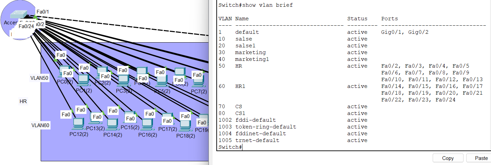
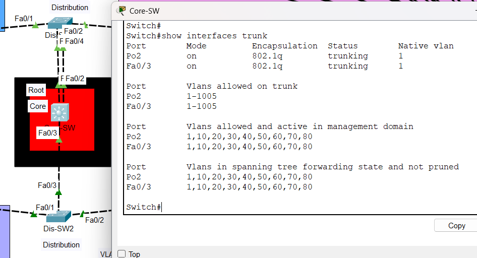
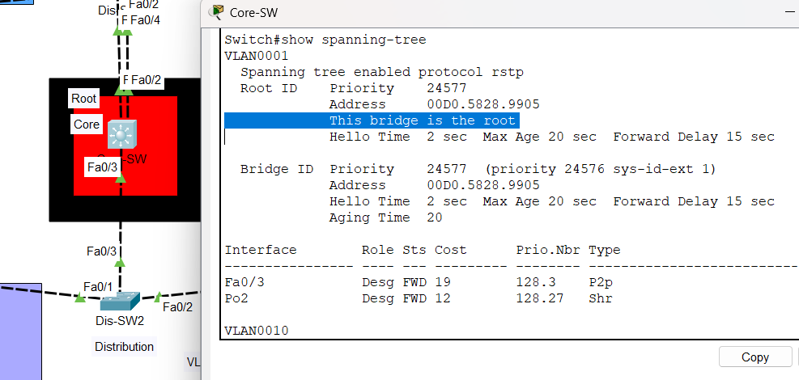
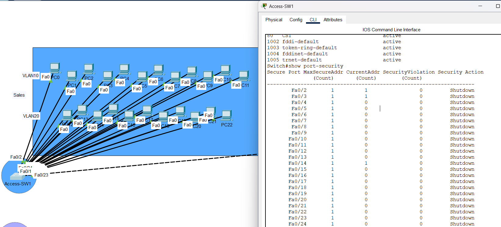
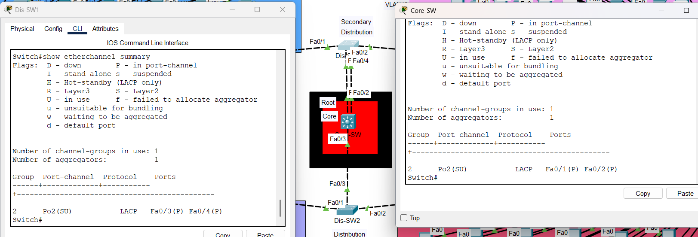
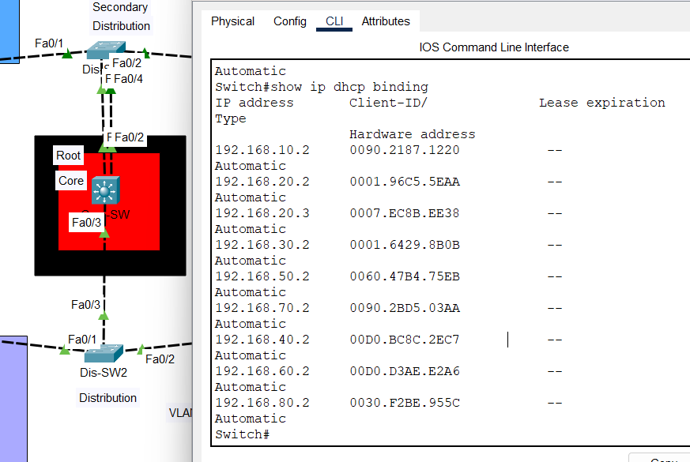

# 🏢 Enterprise Network Design using VLANs, STP & Security

## 📌 Overview

This project demonstrates the design and implementation of a scalable and secure enterprise network infrastructure.
It simulates a real-world company environment with multiple departments, each isolated using VLANs to enhance performance and security.

---

## 🏢 Departments

* Sales
* Marketing
* HR
* Customer Service

Each department is segmented into its own VLAN and subnet.

---

## 🎯 Objectives

* Design a hierarchical network topology
* Implement VLAN segmentation
* Configure trunk links between switches
* Optimize Spanning Tree Protocol (RSTP)
* Apply Layer 2 security mechanisms
* Configure VTP for VLAN management
* Implement EtherChannel for redundancy
* Apply IP addressing and subnetting
* (Optional) Configure DHCP

---

## 🛠️ Technologies & Concepts

* VLANs
* 802.1Q Trunking
* STP / RSTP
* Port Security
* BPDU Guard & PortFast
* VTP
* EtherChannel
* Subnetting

---

## 🖼️ Network Topology



---

## 🌐 VLAN & IP Plan

| Department       | VLAN ID | Subnet                            |
| ---------------- | ------- | --------------------------------- |
| Sales            | 10,20   | 192.168.10.0/27 , 192.168.20.0/27 |
| Marketing        | 30,40   | 192.168.30.0/27 , 192.168.40.0/27 |
| HR               | 50,60   | 192.168.50.0/27 , 192.168.60.0/27 |
| Customer Service | 70,80   | 192.168.70.0/27 , 192.168.80.0/27 |

---

## 🔐 Security Implementation

* Port Security (MAC address limiting)
* BPDU Guard to protect against rogue switches
* PortFast enabled on edge ports

---

## 🔗 Configuration Proof

### VLAN Configuration



### Trunk Links



### Spanning Tree (RSTP)



### Port Security



### Ether Channel



### DHCP Service



---

## 🎥 Project Walkthrough

A full step-by-step implementation is available here:
👉 [https://www.youtube.com/watch?v=_aoE-n2VoPk&list=PLaJvdaeO_sf-ClZkks9f667xbIUjLicuQ]

---

## ⚠️ Challenges Faced

* VLAN assignment inconsistencies
* Trunk misconfiguration between switches
* Incorrect STP root bridge selection

---

## ✅ Solutions

* Verified VLAN consistency across all switches
* Manually configured trunk ports
* Assigned primary and secondary root bridges

---
## 📂 Project Structure

```
📦 Enterprise-Network-Design-Using-VLAN-STP-and-Security
 ┣ 📁 configs/       → Device configurations (switch & router CLI)
 ┣ 📁 screenshots/   → CLI outputs & topology diagrams
 ┣ 📁 docs/          → Supporting documentation & design notes
 ┣ 📄 README.md      → Project overview
 ┣ 🔵 project.pkt    → Packet Tracer project file
 ┗ 🖼️ topology.png   → Network topology diagram
```
---

## 📚 Key Learnings

* Designing enterprise-level network topologies
* Implementing Layer 2 security best practices
* Troubleshooting VLAN and STP issues
* Understanding real-world switching behavior

---

## 🚀 Future Improvements

* Implement Layer 3 routing (Inter-VLAN Routing)
* Add redundancy using HSRP/VRRP
* Integrate firewall and advanced security controls

---

## Project Timeline
- Started: Apr 2025
- Completed: Apr 2025

---

## 👨‍💻 Author

> Developed as part of **Computer Network coursework** — simulating a real-world multi-branch WAN infrastructure using Cisco Packet Tracer.

[](www.linkedin.com/in/youssef-hanna-29759433a)
[](https://github.com/youssefhanna-cs)

---

*⭐ If you found this project useful, consider giving it a star!*
